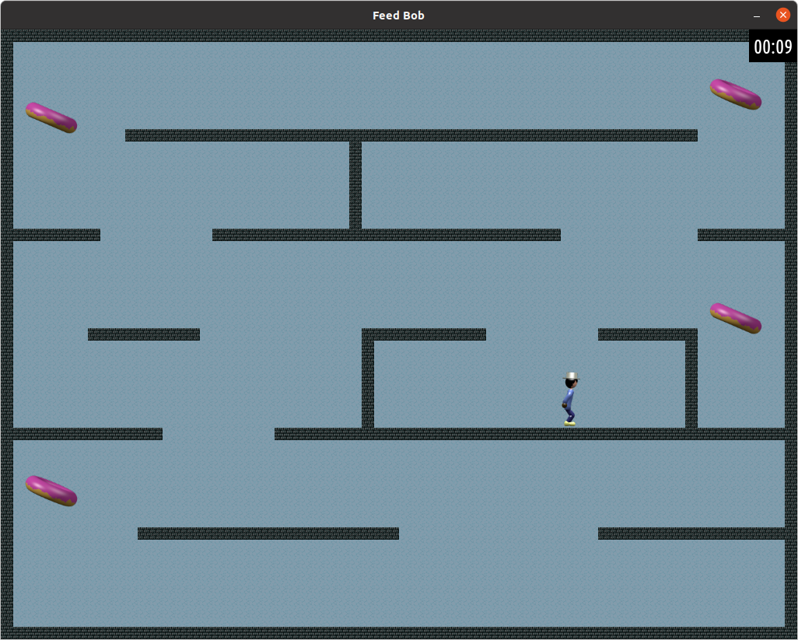

# Feed Bob 1.0

## Description

Ce projet est fait dans le cadre du cours [INF3135 - Construction et maintenance de logiciels](https://etudier.uqam.ca/cours?sigle=INF3135) du Baccalauréat en informatique et génie logiciel de l'UQAM. Il s'agit d'un jeu de plateformes en 2D qui a pour but de nous initier aux applications graphiques, machines à état et animations simples.

## Fonctionnement

Le but du jeu est de ramasser les cinq beignes avec le personnage avant que la minuterie expire. Lorsque le jeu démarre, il y a un menu qui permet de jouer une partie ou quitter. Pour changer l'option du menu, il faut peser sur la touche `haut` ou `bas`. 

Lorsque `play` est sélectionné, la partie commence avec une minuterie de 30 secondes. Pour se déplacer dans le niveau, il suffit de peser les touches `haut`, `bas`, `droite` et `gauche`. Une combinaison de `haut` + `droite` ou `haut` + `gauche` permet de faire sauter le personnage dans l'une ou l'autre des directions. Pour ramasser un beigne, il suffit de se déplacer dessus.

À tout moment on peut quitter le jeu avec la touche `ESC` ou `q`. Lorsque les beingnes sont tous ramassés ou que la minuterie expire avant que l'utilisateur ait ramassé tous les beignes, un message approprié s'affiche et l'utilisateur est retourné au menu de jeu.

## Compilation

Pour compiler l'application, il suffit que que taper `make` dans le répertoire source. Il faut ensuite se déplacer dans le répertoire `bin` avec la commande `cd bin` et ensuite taper `./game`.

## Dépendances

Ce jeu utilise [SDL 2.0](https://www.libsdl.org/) en plus de [SDL_image 2.0](https://www.libsdl.org/projects/SDL_image/), [SDL_ttf 2.0](https://www.libsdl.org/projects/SDL_ttf/) et [SDL_mixer 2.0](https://www.libsdl.org/projects/SDL_mixer/).

## Environnement de développement

Ce jeux à été conçu sur [Ubuntu](https://ubuntu.com/) 16.04 LTS et a été testé récemment sur [Ubuntu](https://ubuntu.com/) 20.04.3 LTS.

## Références

[Tutoriel sur la détection de collisions](http://frums.nl/index/tutorials/showtutorial/1/)  

Utilisation de la structure générale en une version simplifiée sans l'accélération et le deltatime (voir tutoriels #5 et #6). J'ai aussi remplacé le module Rectangle par l'utilisation de SDL_Rect.

[Tutoriaux SDL](https://www.freepascal-meets-sdl.net/)  

Utilisation de la logique de programmation pour faire un fade-in et fade-out (chapitre 6) et l'utilisation de True Type Fonts (chapitre 7).

[Tutoriel SDL Mixer](http://moddb.wikia.com/wiki/SDL_mixer:Tutorials:Playing_an_OGG_Music_File)  

Utilisation de ce tutoriel pourt incorporer de fichiers audio de format OGG.

[Lazy Foo' Tutorials](http://lazyfoo.net/tutorials/SDL/index.php)  

Consultation de ces tutoriels pour différents aspects de la programmation avec SDL, spécialement la logique de minuterie.

[Aaron's tutorials](http://www.aaroncox.net/tutorials/2dtutorials/index.html)  

Consultation de ces tutoriels pour différents aspects de la programmation avec SDL.
